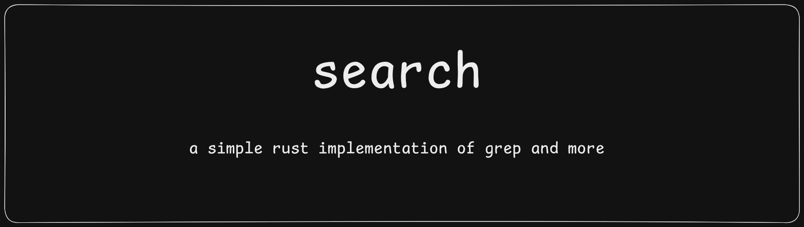

#### introduction
this tool is built for understanding the grep usage and implementation and replicate some feature and improve the overall speed for larger files and make it ai friendly so that it can work on building higher level of context easily for any trained llm.

#### our believes

currently it is highly under development 
and this is not full version as describe above

#### basic usage:
no build is present so you have build it from source

```bash
cargo run -- <pattern> <path> [OPTIONS]
```

#### examples

**plain search:**
```bash
cargo run -- "hello" ./src/main.rs
```

**search with line numbers:**
```bash
cargo run -- "fn main" ./src/main.rs -n
```

**fixed string (no regex):**
```bash
cargo run -- "fn.main" ./src/main.rs -F
```

**regex search:**
```bash
cargo run -- "fn\s+\w+" ./src/main.rs
```

**regex + line numbers:**
```bash
cargo run -- "use \w+" ./src/main.rs -n
```

#### flags

| Flag | Long | Description |
|------|------|-------------|
| `-F` | `--fixed` | treat pattern as fixed string, not regex |
| `-n` | `--line-number` | print line numbers with matches |

