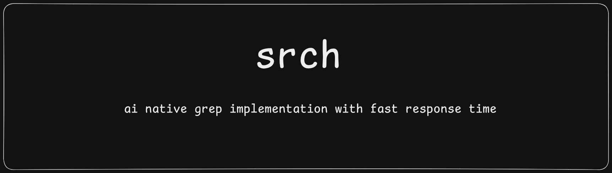

# srch

A fast, grep-inspired search tool built in Rust. Supports regex and fixed-string matching across files and directories, with buffered output optimized for large codebases.

---

## Installation

No pre-built binary is available yet. Build from source using Cargo:

```bash
cargo build --release
./target/release/srch <pattern> <path> [OPTIONS]
```

Or run directly without installing:

```bash
cargo run --release -- <pattern> <path> [OPTIONS]
```

---

## Usage

```
srch <PATTERN> <PATH> [OPTIONS]
```

| Argument | Description |
|----------|-------------|
| `PATTERN` | The search pattern (regex by default) |
| `PATH` | File or directory to search |

### Options

| Flag | Long | Description |
|------|------|-------------|
| `-F` | `--fixed` | Treat pattern as a literal string (disables regex) |
| `-n` | `--line-number` | Prefix each match with its line number |

---

## Examples

**Plain string search:**
```bash
srch "hello" ./src/main.rs
```

**Search with line numbers:**
```bash
srch "fn main" ./src/main.rs -n
```

**Fixed string — disables regex, matches literally:**
```bash
srch "fn.main" ./src/main.rs -F
```

**Regex search:**
```bash
srch "fn\s+\w+" ./src/main.rs
```

**Regex with line numbers:**
```bash
srch "use \w+" ./src/main.rs -n
```

**Search across a directory:**
```bash
srch "TODO" ./src
```

---

## Status

Active development. Core search, regex support, directory traversal, and buffered output are implemented. Additional features are in progress.
